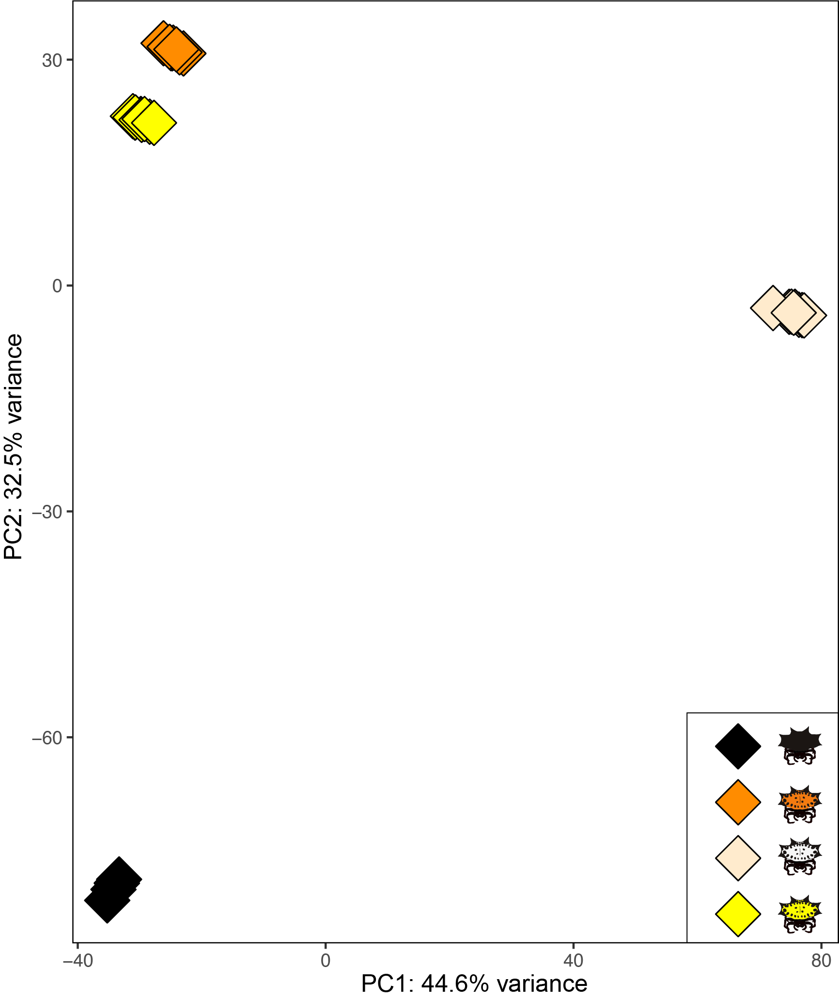
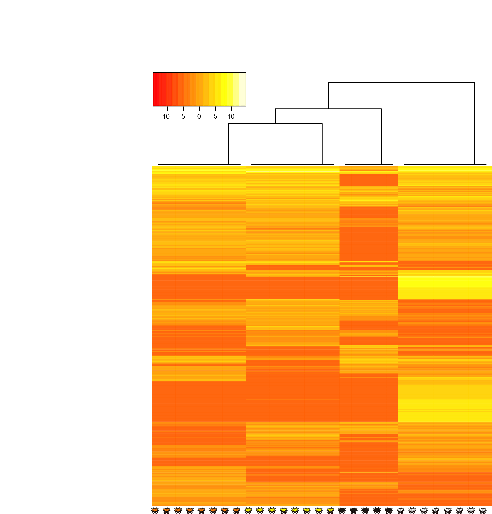
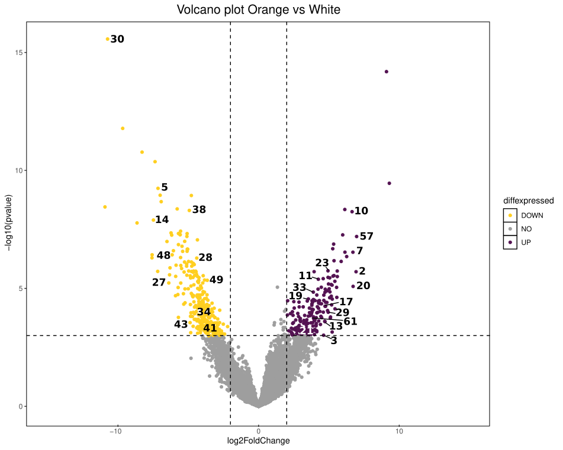

<span style="font-size:0.85em; color:gray;">
¹ Department of Biology, School of Sciences and Engineering, Universidad del Rosario, Bogotá, Colombia  
² Department of Integrative Biology, University ofTexas at Austin, Austin, Texas, USA.
</span>

# De novo transcriptome assembly


## Filter reads

Inspect quality of reads with FastQC


```{bash, eval=FALSE}
# Open directory where reads are and run
fastqc /reads/*.gz
```

Remove erroneous k-mers with rCorrector

```{bash, eval=FALSE}
# A loop is implemented using a text file containing sequence names as input.

for line in $(cat names_reads.txt)
do
run_rcorrector.pl -t 12 -1 "$line"_1.fq.gz -2 "$line"_2.fq.gz
done
```

Remove sequences with Phred score < 30 with Trim Galore

```{bash, eval=FALSE}
# A loop is implemented using a text file with sequence names as input, TrimGalore is executed using the output files generated by rCorrector.

for line in $(cat names_reads.txt)
do
TrimGalore-0.6.0/trim_galore --paired --retain_unpaired --phred33 \
--output_dir trimmed_reads_"$line" --length 36 -q 30 \
--stringency 1 -e 0.1 remove_cor/unfixrm_"$line"_1.cor.fq \
remove_cor/unfixrm_"$line"_2.cor.fq
done
```

## Trinity Assembly

The transcriptome assembly was generated using the filtered reads produced by TrimGalore, with Trinity default parameters, except for the minimum contig length that was set to 2000 bp.

```{bash, eval=FALSE}
/trinity-2.9.1/Trinity --seqType fq --SS_lib_type RF --max_memory 225G \
--CPU 32 --min_contig_length 2000 --left /trim_galore/*.left.fa \
--right /trim_galore/*.right.fa --output ./trinity/trinity_assembly
```

To reduce the complexity of the assembly and identify true transcripts and isoforms, we removed duplicated and misassembled sequences by clustering similar transcripts into groups using CDHIT-est.


```{bash, eval=FALSE}
cd-hit-est -i /trinity/trinity_assembly.fasta -o trinity_cdhit_cmp -c 0.95 -M 32000 -T 16
```

Then, assembly completeness was assessed using the Araneae data set (araneae_odb12) of BUSCO v5.4.0

```{bash, eval=FALSE}
busco -i trinity_cdhit_cmp.fasta -l araneae_odb12 -o out_busco_cdhit_cmp -m tran
```


The assembly was then repeat-masked using RepeatModeler v2.0.1 and RepeatMasker v4.1.5

Repatmodeler y repeatmasker

```{bash, eval=FALSE}
# Create the database with RepeatModeler
RepeatModeler/BuildDatabase -name gasteracantha \
-engine rmblast trinity_cdhit_cmp.fasta

# Run RepeatMasker using the database generated with RepeatModeler

RepeatMasker/RepeatMasker \
-pa 16 -gff -lib consensi.fa.classified trinity_cdhit_cmp.fasta

```

Calculate assembly statistics.

```{bash, eval=FALSE}
TrinityStats.pl trinity_cdhit_cmp.fasta
```

# Functional annotation

All transcripts in the final assembly were identified by blasting them against the NCBI's non-redundant (nr) database using BLASTx Diamond v2.1.8 with an e-value cutoff of 1e-5.

```{bash, eval=FALSE}
# Create diamond nr Database

diamond makedb --in nr.gz -d db_nr

# Run blastx against nr Database

diamond blastx
--db db_nr.dmnd -q trinity_cdhit_cmp.fasta \
--out ./blast_pigment.outfmt --outfmt 5 --evalue 1e-5
```

Blastx output was used to
functional annotation in Blast2GO to predict Gene Ontology (GO)  and transcriptome assembly was input to KEGG annotation.

Next, the assembled transcriptome was translated into potential proteins according to ORF prediction by TransDecoder v.5.7.1 and the potential coding transcripts were also annotated against the Swiss-Prot database.

```{bash, eval=FALSE}
# Run TransDecoder

TransDecoder/5.5.0/TransDecoder.LongOrfs -t trinity_cdhit_cmp.fasta -m 10

# Run blastp against Swiss-Prot Database
# Create database
diamond makedb --in uniprot_sprot.fasta.gz -d db_swisprot
# Run blastp using TransDecoder output as query

diamond blastp --db db_swisprot.dmnd -q  longest_orfs.pep
--out ./blasp_swiss.outfmt --outfmt 6 --evalue 1e-5
```

# Read mapping and differential expression analyses

## Read mapping
The reference transcriptome index was constructed using Bowtie2, and transcript abundance per individual was estimated using the Trinity script align_and_estimate_abundance.pl. The input file seq_file.txt contains the file paths for each filtered read.

```{bash, eval=FALSE}
align_and_estimate_abundance.pl --seqType fq \
--samples_file seq_file.txt --transcripts trinity_cdhit_cmp.fasta --est_method RSEM --aln_method bowtie2 --trinity_mode --prep_reference \
--output_dir .
```

The mapping output consisted of BAM files and a .isoforms.results file for each individual. The first step was to rename and move these files, which was done using a for loop with the same txt file containing the read names used above.

```{bash, eval=FALSE}
for line in $(cat names_reads.txt)
do
mv $line/RSEM.isoforms.results isoforms_results/$line.isoforms.results
done
```

Read counts from all samples were combined into a single matrix using the abundance_estimate_to_matrix.pl script implemented in Trinity.

```{bash, eval=FALSE}
abundance_estimates_to_matrix.pl --est_method RSEM \
--gene_trans_map Trinity.fasta.gene_trans_map \
--out_prefix Trinity_trans_cmp isoforms_results/*isoforms.results
```

## Differential expression analysis

### Preparing data

```{r, eval=FALSE}
# Load packages
library(DESeq2)
library(edgeR)
library(ggrepel)
library(gplots)
library(dplyr)
# Load un-normalized counts matrix created with abundance_estimates_to_matrix.pl script
x<-read.table("cp_Trinity_trans_cmp.isoform.counts.matrix")
x<-as.matrix(x)
#sum 1 to avoid zero error
x<-x+1

# Create a matrix to relate each individual to its corresponding coloration morph.

names<-c()
for (i in seq(1:5)){
        names<-c(names,gsub(" ", "",paste("PTBL00",i)))
}
for (i in seq(1:8)){
        names<-c(names,gsub(" ", "",paste("PTOR00",i)))
}
for (i in seq(1:8)){
        names<-c(names,gsub(" ", "",paste("PTWH00",i)))
}
for (i in seq(1:8)){
        names<-c(names,gsub(" ", "",paste("PTYE00",i)))
}
groupbl<-c(rep("Black",5))
groupor<-c(rep("Orange",8))
groupwh<-c(rep("White",8))
groupye<-c(rep("Yellow",8))
group<-factor(c(groupbl,groupor,groupwh,groupye))
coldata<-data.frame(group)
rownames(coldata)<-names
```

Create DESeq object, followed by normalization of count data.

```{r, eval=FALSE}
dds<- DESeqDataSetFromMatrix(countData = round(x),colData = coldata,design = ~ group)
dds<- DESeq(dds)

counts<- counts(dds)
y<- DGEList(counts=counts)
y$samples$group <- factor(group)
design <- model.matrix(~0+group, data=y$samples)
colnames(design) <- levels(y$samples$group)

y<-calcNormFactors(y)
y<-estimateDisp(y,design)
fit <- glmQLFit(y,design)
```

Then we ordered genes based on variance, and the top 5000 most variable were retained.

```{r, eval=FALSE}
var_genes <- apply(fit, 1, var)
select_var <- names(sort(var_genes, decreasing=TRUE))[1:5000]
highly_variable <- fit[select_var,]
variable_genes<-rownames(highly_variable)
```

Transform data

```{r, eval=FALSE}
DDS <- DESeqDataSetFromMatrix(countData = round(fit$fitted.values),
 colData = fit$samples, design = ~group)
DDS_transform<- rlog(DDS, blind = TRUE)
DDS_transform_filt<-DDS_transform[select_var, ]
```

### PCA Visualization

```{r, eval=FALSE}
mat <- assay(DDS_transform_filt)
pca <- prcomp(t(mat), scale. = TRUE)
pca_df <- as.data.frame(pca$x)
pca_df$sample <- rownames(pca_df)
pca_df <- cbind(pca_df, as.data.frame(colData(DDS_transform_filt)))
explained_var <- round(100 * (pca$sdev^2 / sum(pca$sdev^2)), 1)

ggplot(pca_df, aes(PC1, PC2, color = group,fill=group)) +
  geom_point(size = 8,shape=23) +                                                  
  xlab(paste0("PC1: ", explained_var[1], "% variance")) +
  ylab(paste0("PC2: ", explained_var[2], "% variance")) +
   scale_color_manual(values=c(                                                     
    "black","black","black","black")) +                                                  
    scale_fill_manual(values = c(                                                           
    "black","darkorange","blanchedalmond","yellow")) +                                     
theme(panel.background = element_rect(fill = "white",colour = "black"))
```


### Heatmap

```{r, eval=FALSE}
heatmap.2(mat,trace="none",key=TRUE)
```





### Volcano plots

Make contrasts to compare between color morphs.

```{r, eval=FALSE}
codes<-read.csv("trans_id_code.csv")
res_OvsY <- results(dds, contrast=c("group","Orange","Yellow"),alpha=0.05)
res_OvsW <- results(dds, contrast=c("group","Orange","White"),alpha=0.05)
res_YvsW <- results(dds, contrast=c("group","Yellow","White"),alpha=0.05)
res_BvsW <- results(dds, contrast=c("group","Black","White"),alpha=0.05)
res_BvsO <- results(dds, contrast=c("group","Black","Orange"),alpha=0.05)
res_BvsY <- results(dds, contrast=c("group","Black","Yellow"),alpha=0.05)

OvsY<-as.data.frame(res_OvsY)
OvsW<-as.data.frame(res_OvsW)
YvsW<-as.data.frame(res_YvsW)
BvsW<-as.data.frame(res_BvsW)
BvsO<-as.data.frame(res_BvsO)
BvsY<-as.data.frame(res_BvsY)
```

Differentially expressed transcripts were identified between contrasts. The following analysis is shown for a single comparison of color morphs, although the same approach was applied to all comparisons.

```{r, eval=FALSE}
# Create a column to distinguish upregulated from downregulated genes.

OvsW$diffexpressed <- "NO"
OvsW$diffexpressed[OvsW$log2FoldChange > 2 & OvsW$padj < 0.05] <- "UP"
OvsW$diffexpressed[OvsW$log2FoldChange < -2 & OvsW$padj < 0.05] <- "DOWN"

# Add trans id as column of dataframe
OvsW$trans_id<-rownames(OvsW)
# Add numeric codes of pigment detected genes
OvsW_code<-merge(OvsW,codes,by="trans_id",all=T)

OvsW_code <- OvsW_code %>%
  mutate(code = ifelse(diffexpressed == "NO", NA, code))

# Create volcano plot

mynamestheme <- theme(plot.title = element_text(size = (16),hjust=0.5))

volcano_OvsW<-ggplot(data=OvsW_code, aes(x=log2FoldChange, y=-log10(pvalue), col=diffexpressed)) +
        geom_point() +
        xlim(-15,15)+
        theme(panel.background = element_rect(fill = "white",colour = "black")) +
        geom_text_repel(label=OvsW_code$code,box.padding = 0.5, max.overlaps = Inf,colour="black") +
        scale_color_manual(values=c("#FFCF20FF","gray62","#541352FF")) +
        geom_vline(xintercept=c(-2, 2),linetype = "dashed", col="black") +
        geom_hline(yintercept=3, linetype = "dashed", col="black") + mynamestheme +
        #annotate("rect", xmin = 3, xmax = 30, ymin = -log10(0.01), ymax = 16, alpha=.2, fill="#541352FF") +
        #annotate("rect", xmin = -5, xmax = -30, ymin = -log10(0.01), ymax = 16, alpha=.2, fill="#FFCF20FF") +
        ggtitle("Volcano plot Orange vs White")
```



# Enrinchment analysis

```r
##OvsW
translen<-read.table("trans_length.txt")
interesting_set<-read.csv("~/Documents/gasteracantha/analisis_2025/edgeR_2025/volcano_input_tables/OvsW_code.csv")
shrink<-merge(interesting_set,translen,by="trans_id",all.x=T)
sigData <- as.integer(shrink$diffexpressed!="NO")
names(sigData)<-shrink$trans_id
mypwf <- nullp(DEgenes=sigData,bias.data=shrink$len)
GO.wall <- goseq(pwf=mypwf,gene2cat=term2gene,use_genes_without_cat=TRUE)
GO.wall <- cbind(
  GO.wall,
  padj_overrepresented=p.adjust(GO.wall$over_represented_pvalue, method="BH"),
  padj_underrepresented=p.adjust(GO.wall$under_represented_pvalue, method="BH")
)
GO.wall <- na.omit(GO.wall)
pdf("goseq_plots/OvsW_goseqplot_padj_all.pdf",width=15,height=10)
GO.wall %>%
  top_n(15, wt=-over_represented_pvalue) %>%
  mutate(hitsPerc=numDEInCat*100/numInCat) %>%
  ggplot(aes(x=hitsPerc,
             y=term,
             colour=padj_overrepresented,
             size=numDEInCat)) +
  geom_point() +
  expand_limits(x=0) +
  labs(x="Hits (%)", y="GO term", colour="padj", size="Count")
dev.off()
#BvsO
interesting_set<-read.csv("~/Documents/gasteracantha/analisis_2025/edgeR_2025/volcano_input_tables/BvsO_code.csv")
shrink<-merge(interesting_set,translen,by="trans_id",all.x=T)
sigData <- as.integer(shrink$diffexpressed!="NO")
names(sigData)<-shrink$trans_id
mypwf <- nullp(DEgenes=sigData,bias.data=shrink$len)
GO.wall <- goseq(pwf=mypwf,gene2cat=term2gene,use_genes_without_cat=TRUE)
GO.wall <- cbind(
  GO.wall,
  padj_overrepresented=p.adjust(GO.wall$over_represented_pvalue, method="BH"),
  padj_underrepresented=p.adjust(GO.wall$under_represented_pvalue, method="BH")
)
GO.wall <- na.omit(GO.wall)
pdf("goseq_plots/BvsO_goseqplot_padj_all.pdf",width=15,height=10)
GO.wall %>%
  top_n(15, wt=-over_represented_pvalue) %>%
  mutate(hitsPerc=numDEInCat*100/numInCat) %>%
  ggplot(aes(x=hitsPerc,
             y=term,
             colour=padj_overrepresented,
             size=numDEInCat)) +
  geom_point() +
  expand_limits(x=0) +
  labs(x="Hits (%)", y="GO term BvsO", colour="padj", size="Count")
dev.off()
#BvsY
interesting_set<-read.csv("~/Documents/gasteracantha/analisis_2025/edgeR_2025/volcano_input_tables/BvsY_code.csv")
shrink<-merge(interesting_set,translen,by="trans_id",all.x=T)
sigData <- as.integer(shrink$diffexpressed!="NO")
names(sigData)<-shrink$trans_id
mypwf <- nullp(DEgenes=sigData,bias.data=shrink$len)
GO.wall <- goseq(pwf=mypwf,gene2cat=term2gene,use_genes_without_cat=TRUE)
GO.wall <- cbind(
  GO.wall,
  padj_overrepresented=p.adjust(GO.wall$over_represented_pvalue, method="BH"),
  padj_underrepresented=p.adjust(GO.wall$under_represented_pvalue, method="BH")
)
GO.wall <- na.omit(GO.wall)
GO.wall <- GO.wall %>%
  filter(!str_detect(term, "viral RNA genome replication"))

pdf("goseq_plots/BvsY_goseqplot_padj_all.pdf",width=15,height=10)
GO.wall %>%
  top_n(15, wt=-over_represented_pvalue) %>%
  mutate(hitsPerc=numDEInCat*100/numInCat) %>%
  ggplot(aes(x=hitsPerc,
             y=term,
             colour=padj_overrepresented,
             size=numDEInCat)) +
  geom_point() +
  expand_limits(x=0) +
  labs(x="Hits (%)", y="GO term BvsY", colour="padj", size="Count")
dev.off()
#BvsW
interesting_set<-read.csv("~/Documents/gasteracantha/analisis_2025/edgeR_2025/volcano_input_tables/BvsW_code.csv")
shrink<-merge(interesting_set,translen,by="trans_id",all.x=T)
sigData <- as.integer(shrink$diffexpressed!="NO")
names(sigData)<-shrink$trans_id
mypwf <- nullp(DEgenes=sigData,bias.data=shrink$len)
GO.wall <- goseq(pwf=mypwf,gene2cat=term2gene,use_genes_without_cat=TRUE)
GO.wall <- cbind(
  GO.wall,
  padj_overrepresented=p.adjust(GO.wall$over_represented_pvalue, method="BH"),
  padj_underrepresented=p.adjust(GO.wall$under_represented_pvalue, method="BH")
)
GO.wall <- na.omit(GO.wall)
GO.wall <- GO.wall %>%
  filter(!str_detect(term, "viral RNA genome replication"))

pdf("goseq_plots/BvsW_goseqplot_padj_all.pdf",width=15,height=10)
GO.wall %>%
  top_n(15, wt=-over_represented_pvalue) %>%
  mutate(hitsPerc=numDEInCat*100/numInCat) %>%
  ggplot(aes(x=hitsPerc,
             y=term,
             colour=padj_overrepresented,
             size=numDEInCat)) +
  geom_point() +
  expand_limits(x=0) +
  labs(x="Hits (%)", y="GO term BvsW", colour="padj", size="Count")
dev.off()
#OvsY
interesting_set<-read.csv("~/Documents/gasteracantha/analisis_2025/edgeR_2025/volcano_input_tables/OvsY_code.csv")
shrink<-merge(interesting_set,translen,by="trans_id",all.x=T)
sigData <- as.integer(shrink$diffexpressed!="NO")
names(sigData)<-shrink$trans_id
mypwf <- nullp(DEgenes=sigData,bias.data=shrink$len)
GO.wall <- goseq(pwf=mypwf,gene2cat=term2gene,use_genes_without_cat=TRUE)
GO.wall <- cbind(
  GO.wall,
  padj_overrepresented=p.adjust(GO.wall$over_represented_pvalue, method="BH"),
  padj_underrepresented=p.adjust(GO.wall$under_represented_pvalue, method="BH")
)
GO.wall <- na.omit(GO.wall)
GO.wall <- GO.wall %>%
  filter(!str_detect(term, "viral RNA genome replication"))

pdf("goseq_plots/OvsY_goseqplot_padj_all.pdf",width=15,height=10)
GO.wall %>%
  top_n(15, wt=-over_represented_pvalue) %>%
  mutate(hitsPerc=numDEInCat*100/numInCat) %>%
  ggplot(aes(x=hitsPerc,
             y=term,
             colour=padj_overrepresented,
             size=numDEInCat)) +
  geom_point() +
  expand_limits(x=0) +
  labs(x="Hits (%)", y="GO term OvsY", colour="padj", size="Count")
dev.off()
interesting_set<-read.csv("~/Documents/gasteracantha/analisis_2025/edgeR_2025/volcano_input_tables/YvsW_code.csv")
shrink<-merge(interesting_set,translen,by="trans_id",all.x=T)
sigData <- as.integer(shrink$diffexpressed!="NO")
names(sigData)<-shrink$trans_id
mypwf <- nullp(DEgenes=sigData,bias.data=shrink$len)
GO.wall <- goseq(pwf=mypwf,gene2cat=term2gene,use_genes_without_cat=TRUE)
GO.wall <- cbind(
  GO.wall,
  padj_overrepresented=p.adjust(GO.wall$over_represented_pvalue, method="BH"),
  padj_underrepresented=p.adjust(GO.wall$under_represented_pvalue, method="BH")
)
GO.wall <- na.omit(GO.wall)
GO.wall <- GO.wall %>%
  filter(!str_detect(term, "viral RNA genome replication"))

pdf("goseq_plots/YvsW_goseqplot_padj_all.pdf",width=15,height=10)
GO.wall %>%
  top_n(15, wt=-over_represented_pvalue) %>%
  mutate(hitsPerc=numDEInCat*100/numInCat) %>%
  ggplot(aes(x=hitsPerc,
             y=term,
             colour=padj_overrepresented,
             size=numDEInCat)) +
  geom_point() +
  expand_limits(x=0) +
  labs(x="Hits (%)", y="GO term YvsW", colour="padj", size="Count")
dev.off()

```

## Signatures of selection


Creacion de transcriptoma por cada morfotipo de coloración

```bash
for line in cat $(color_names.txt)
do
Trinity --seqType fq \
--SS_lib_type RF --max_memory 225G --CPU 32 --min_contig_length 2000 \
--samples_file $line_seq_file.txt \
--output trinity_colors/trinity_$line
done
```

Aplicamos los filtros correspondientes a cada ensamblaje_colores

Cdhit
```bash
for line in cat $(color_names.txt)
do
cdhit/cd-hit-est -i trinity_colors/trinity_$line/trinity_assembly.fasta \
-o trinity_cdhit_$line -c 0.95 -M 32000 -T 16
done
```
Repatmodeler y repeatmasker
```bash
for line in cat $(color_names.txt)
do
RepeatModeler/BuildDatabase -name gasteracantha_$line \
-engine rmblast cdhit/trinity_cdhit_$line.fasta

RepeatModeler/RepeatModeler -database gasteracantha_$line -engine rmblast -pa 16

perl RepeatMasker -pa 16 -gff -lib /run_repeatmodeler/rm_out_$line/consensi_$line.fa  cdhit/trinity_cdhit_$line.fasta -dir repeatmasker_$line

done
```

Para codeml los codones de parada son un problema, entonces lo que tenemos que hacer es convertir cada ensamblaje en proteina con TransDecoder

```bash
for i in $(cat name_color.txt)
do
/home/fabianc.salgado/shared/TransDecoder/5.5.0/TransDecoder.LongOrfs \
-t /home/fabianc.salgado/shared/paula_torres/gasteracantha/Repeat/run_repeatmasker/rmblast/run_rmblast_colors/repeatmasker_$i/trinity_cdhit_$i.fasta.masked \
-m 10 --output_dir ./transdecoder_$i
done
```

Posteriormente hacemos un blast para ubicar cada transcrito de interes en el ensamblaje de cada morfotipo de coloración

```bash
for line in cat $(color_names.txt)
do

diamond makedb --in run_repeatmasker/rmblast/repeatmasker_$line/trinity_cdhit_$line.fasta.masked \
-d db_gasteracantha_$line
done
```
Corremos el blast

```bash
for line in cat $(color_names.txt)
do

blastn -query interested_transcripts.fasta \
-db db_gasteracantha_$line -outfmt 7 -out blast_$line.outfmt -num_threads 24

done
```

Cambiamos los nombres
```bash
IFS=$'\n'
for line in $(cat yellow_names_color_genes_missing.txt)
do
variable2=$(echo $line|grep -oE "\w+\.\w+$")
grep -A1 $variable2[[:space:]] ~/sharedls
/paula_torres/gasteracantha/transdecoder/transdecoder_colors/transdecoder_black/longest_orfs.pep >> WvsA_protein_black.fasta
done


grep -A1 $variable2[[:space:]] ~/shared/paula_torres/gasteracantha/transdecoder/transdecoder_colors/transdecoder_black/longest_orfs.pep >> WvsA_protein_black.fasta
done

IFS=$'\n'
for line in $(cat column12.txt)
do
variable1=$(echo $line|grep -oE "^\w+")
variable2=$(echo $line|grep -oE "\w+\.\w+$")
sed -i -E 's/'$variable2'/'$variable1'/g' color_trans.fas
done

IFS=$'\n'
for line in $(cat codenames.txt)
do
variable1=$(echo $line|grep -oE "^\w+")
variable2=$(echo $line|grep -oE "\w+$")
mv $variable1.fastq $variable2.fq
done
```
Ahora generamos un unico archivo por cada transcriptoma

```bash
for line in $(cat ../names_trans.txt)
do
awk '/^>/ {printf("\n%s\n",$0);next; } { printf("%s",$0);}  END {printf("\n");}' < trans_cp_replaced.fasta > ./one_line_trans_cp_replaced.fasta
done

#separamos cada transcrito en un archivo
for line in $(cat names_trans_codeml.txt)
do
grep -A1 $line one_line_trans_cp_replaced_nostop.fasta > fasta_files/"$line"_nucl.fas
done
sed -i -E 's/one_line_WvsA_nucl_\w+.fas\://g' WvsA_TRINITY_DN*
sed -i -E 's/one_line_WvsA_nucl_\w+.fas\-//g' WvsA_TRINITY_DN*
sed -i -E 's/--//g' WvsA_TRINITY_DN*
```

- Translator
```bash
##hacemos alineamiento
mkdir alineamiento
for line in $(cat names_trans_codeml.txt)
do
/home/paula/Documents/gasteracantha/codeml/paml-tutorial/positive-selection/00_data/translatorX_perl/translatorX.pl -i fasta_files/"$line"_nucl.fas \
 -p F -o alineamiento/"$line"_mafft
done

##borramos archivos innecesarios
rm *aaseqs.fasta
rm *aaseqs
rm *.mafft.log
rm *nt3_ali.fasta
rm *nt2_ali.fasta
rm *nt1_ali.fasta
rm *nt12_ali.fasta
rm *.html
```
- Mafft aligment
- pal2nal

```bash
##corremos pal2nl
mkdir pal2nl
for line in $(cat names_trans_codeml.txt)
do
/home/paula/Documents/gasteracantha/codeml/paml-tutorial/positive-selection/00_data/scripts/pal2nal_v14/pal2nal.pl \
./alineamiento/"$line"_mafft.aa_ali.fasta ./alineamiento/"$line"_mafft.nt_ali.fasta \
-output fasta > ./pal2nl/"$line"_pal2nal.fasta
done

##pasamos los resultados a 1 linea

for line in $(cat names_trans_codeml.txt)
do
awk '/^>/ {printf("\n%s\n",$0);next; } { printf("%s",$0);}  END {printf("\n");}' < ./pal2nl/"$line"_pal2nal.fasta  > ./pal2nl/one_"$line"_pal2nal.fasta
done

##hay que borrar la primera linea
for line in $(cat ../names_trans_codeml.txt)
do
sed -i '1d' one_"$line"_pal2nal.fasta
done
```

- fastconcat

```bash
##convertimos a phylip-hay que hacerlo con fastconcat
for line in $(cat ../names_trans_codeml.txt)
do mkdir Fastconcat_$line
done

for line in $(cat ../names_trans_codeml.txt)
do
cp ../pal2nl/one_"$line"_pal2nal.fasta Fastconcat_$line
done


#Ejecutamos FASTCONCAT en cada carpeta
for line in $(cat ../names_trans_codeml.txt)
do
cd Fastconcat_"$line"
~/Documents/scripts/FASconCAT-G_v1.05.1.pl -s -p -p
cd ..
done


#luego cambiamos los nombres:
for line in $(cat ../names_trans_codeml.txt)
do mv Fastconcat_$line/FcC_supermatrix.fas Fastconcat_$line/"$line".fas
done

for line in $(cat ../names_trans_codeml.txt)
do mv Fastconcat_$line/FcC_supermatrix.phy Fastconcat_$line/"$line".phy
done


#guardamos todos los phy en una carpeta
mkdir ../phylip_files
for line in $(cat ../names_trans_codeml.txt)
do
cp Fastconcat_$line/*.phy ../phylip_files
done
```

- raxml

```bash
##raxml code
#!/bin/bash

#SBATCH -p normal
#SBATCH -N 1
#SBATCH -n 32
#SBATCH -t 20-12:30:30
#SBATCH -o raxml_mafft.out
#SBATCH -e error_raxml_mafft.err

module load raxml
for line in $(cat ../files_names.txt)
do
raxmlHPC -f a -m GTRGAMMA -p 12345 -# 100 -x 12345 -# 500 -s ../phylip_files/"$line".phy -n "$line"
done


##enraizamos cada arbol en figtree, lo exportamos y cambiamos nombres
for line in $(cat ../names_trans_codeml.txt)
do
mv RAxML_bestTree."$line" "$line"_unroot.tree
done

for line in $(cat ../shared_names.txt)
do
mv WvsOY_"$line"_pal2nal_mafft.treefile WvsOY_"$line"_unroot.tree
done

for line in $(cat ../longest_orf_drosophila/trans_codes.txt)
do mv rooted_"$line"_pal2nal_mafft.phy "$line"_rooted.tree
done

##eliminamos los valores de branch lengths
for line in $(cat ../names_tree.txt)
do
printf "4  1\n" > nobl_tree/"$line"_unroot_nobl.tree
sed 's/\:[0-9]*\.[0-9]*//g' "$line"_unroot.tree >> nobl_tree/"$line"_unroot_nobl.tree
done

for line in $(cat trans_names.txt)
do
printf "101  1\n" > nobl_tree/"$line"_rooted_nobl.tree
sed 's/\:[0-9]*\.[0-9]*//g' MLtree/"$line"_rooted.tree >> nobl_tree/"$line"_rooted_nobl.tree
done


for line in $(cat ../trans_names.txt)
do
sed -i -E 's/E-[1-9]//g' nobl_tree/"$line"_rooted_nobl.tree
sed -i -E 's/E-[1-9]//g' nobl_tree/"$line"_unroot_nobl.tree
sed -i "s/'//g" nobl_tree/"$line"_unroot_nobl.tree
sed -i "s/'//g" nobl_tree/"$line"_rooted_nobl.tree
done


for line in $(cat ../names_trans.txt)
do
sed -i 's/SEQ/'$line'/g' codeml_"$line"/codeml-pairwise.ctl
done
```

- run codeml plot

```bash
##seting sed parameters para codeml por sitios

for line in $(cat ../shared_names.txt)
do
mkdir WvsA_codeml_"$line"
done

for line in $(cat ../shared_names.txt)
do
cp ../../../paml-tutorial/positive-selection/01_protocol_analyses/00_homogenous_model/Model_M0/codeml-M0.ctl WvsA_codeml_"$line"
done

for line in $(cat ../shared_names.txt)
do sed -i 's|\.\.\/\.\.\/\Mx_aln.phy|\.\.\/\.\.\/phylip_files\/nostop\/WvsA_'$line'_nostop_pal2nal_mafft.phy|g' WvsA_codeml_$line/codeml-M0.ctl
done

for line in $(cat names.txt)
do
sed -i 's|\.\.\/\.\.\/|\.\.\/\.\.\/all_diff\/|g' codeml_"$line"/codeml-pairwise.ctl
done


for line in $(cat names.txt)
do
sed -i 's/'$line'_out\.txt/pairwise_'$line'_out\.txt/g' codeml_"$line"/codeml-pairwise.ctl
done

for line in $(cat ../shared_names.txt)
do sed -i 's|Mx_unroot.tree|tree\/nobl_tree\/WvsA_'$line'_unroot_nobl.tree|g' WvsA_codeml_$line/codeml-M0.ctl
done


for line in $(cat ../shared_names.txt)
do sed -i 's|out_M0.txt|\.\/WvsA_'$line'_out.txt|g' WvsA_codeml_$line/codeml-M0.ctl
done

##run codeml
for line in $(cat ../names_tree.txt)
do
cd codeml_$line
/home/paula/Documents/gasteracantha/codeml/paml-tutorial/positive-selection/src/CODEML/codeml4.10.6 codeml-pairwise.ctl
cd ..
done


#extraemos omega values
for line in $(cat ../names_tree.txt)
do
grep -A 50 "pairwise comparison, codon frequencies: Fequal" codeml_"$line"/pairwise_"$line"_out.txt >> pairwise_values.txt
done
```

plot en R

```r
library(readr)
library(ggplot2)
library(dplyr)
libary(tidyverse)

omega<-read.table("cp_66_omega_values.txt",sep="\t",head=F)
colnames(omega)<-c("trans_id","pairwise","dN/dS","dN","dS")

omega_dnds<-omega %>%
select("trans_id","pairwise","dN/dS")

omega_wide <- omega_dnds %>%
  pivot_wider(names_from = pairwise, values_from = dN/dS)


# Ver resultado
print(df_wide)
omega_all_names <- read_delim("omega_all_names.txt", delim = "\t", escape_double = FALSE, col_names = FALSE, trim_ws = TRUE)
colnames(omega_all_names)<-c("gene","omega")

plot<-ggplot(omega_all_names, aes(factor(gene), omega ,label=gene)) +
geom_point() + geom_text(aes(label=ifelse(omega>1,as.character(gene),'')),hjust=0, vjust=0) +
theme(axis.text.x=element_blank(),panel.background = element_rect(fill = "white",colour = "black")) +
ggtitle("omega_all_diff_exp")

```

<script>
document.addEventListener("DOMContentLoaded", function() {
    let enlacesTOC = document.querySelectorAll('#TOC a');

    enlacesTOC.forEach(enlace => {
        enlace.addEventListener('click', function() {
            // 1. Le quita el fondo azul a todos los elementos de la tabla
            enlacesTOC.forEach(e => e.classList.remove('fijar-azul'));
            // 2. Le pone el fondo azul permanentemente al que acabas de hacer clic
            this.classList.add('fijar-azul');
        });
    });
});
</script>
